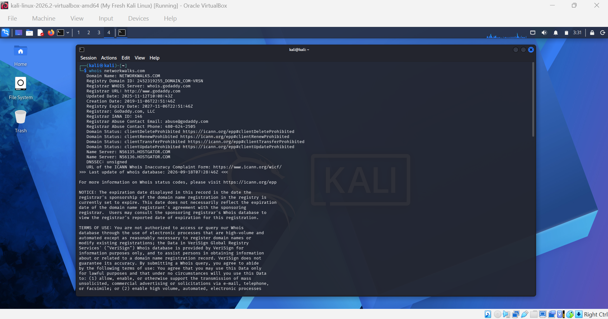
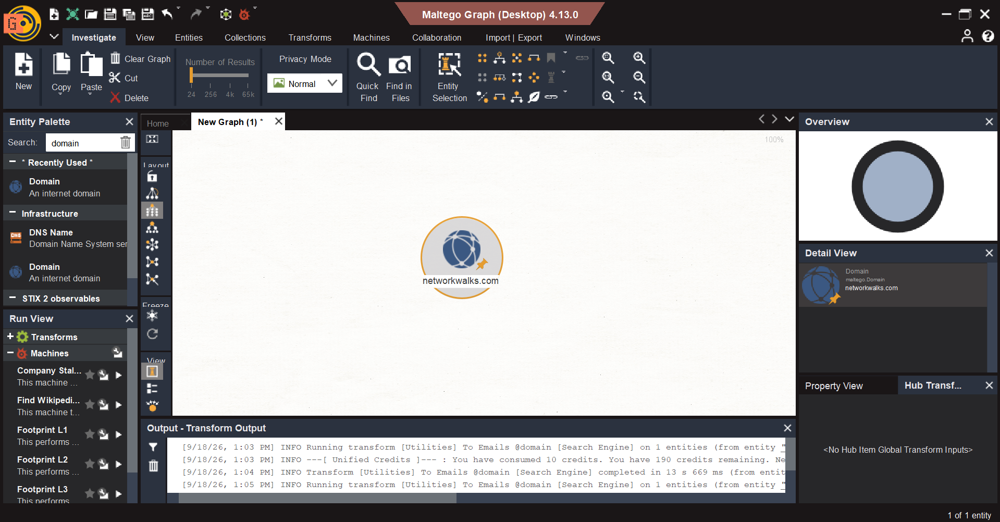
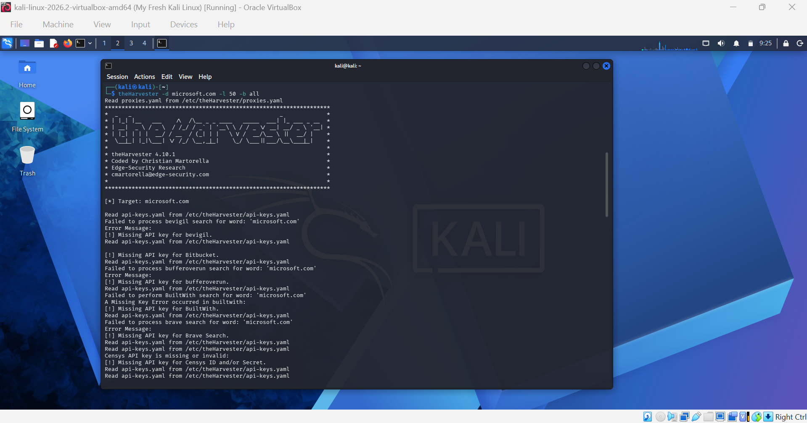
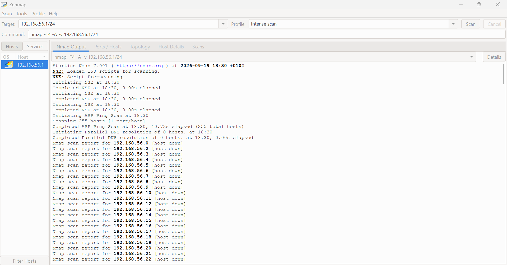

# 🔍 Footprinting and Network Scanning
**Reconnaissance, Information Gathering, and Network Discovery**

  
  
  
  
  
  
  

---

## 📌 Overview

Week 2 of the NetworkWalks Cybersecurity & Ethical Hacking Internship 
focused on the reconnaissance and information gathering phase of a 
security assessment.

This is one of the most important stages in any security engagement. 
Before you can test a system, you need to understand what's out there. 
The five practicals this week covered passive and active reconnaissance 
techniques, publicly available information gathering, visual link 
analysis, footprinting, and authorized network scanning.

All activities were performed in controlled, authorized environments 
strictly for educational and cybersecurity training purposes.

---

## 🎯 Objectives

- Use multiple Kali Linux tools to perform basic footprinting and 
  reconnaissance
- Explore the Google Hacking Database (GHDB) for publicly indexed 
  information discovery
- Use Maltego for visual link analysis and digital footprint mapping
- Use TheHarvester to gather publicly available domains, subdomains, 
  and email addresses
- Use Zenmap to discover active hosts and visualize network topology 
  on an authorized local network

---

## 🛠️ Tools Used

| Tool                | Purpose                                             |
|---------------------|--------------------------------------------------   |
| Kali Linux          | Primary operating system for all security testing   |
| WHOIS               | Domain registration information gathering           |
| WhatWeb             | Web technology identification                       |
| Nslookup            | DNS query and domain resolution                     |
| cURL                |  HTTP response header retrieval                     |
| Wafw00f             | Web Application Firewall detection                  |
| DNSRecon            | DNS enumeration and record gathering                |
| GHDB                | Advanced search operator reconnaissance             |
| Maltego             | Visual link analysis and entity mapping             |
| TheHarvester        | Public information gathering domains, emails, hosts |
| Zenmap              | Graphical Nmap interface for network discovery      |
| Windows CMD         | Local network configuration identification          |

---

## 📋 Practicals Completed

### W2-PM1 — Multiple Kali Linux Tools

Used WHOIS, WhatWeb, Nslookup, cURL, Wafw00f, and DNSRecon against 
an authorized target to collect domain registration details, identify 
web technologies, resolve DNS records, examine HTTP headers, detect 
WAF protection, and enumerate DNS infrastructure.

Each tool revealed a different layer of publicly available information — 
demonstrating how combining multiple reconnaissance tools builds a 
much more complete picture of a target than any single tool alone.

---

### W2-PM2 — Google Hacking Database (GHDB)

Explored advanced Google search operators through the GHDB to 
understand how publicly indexed information can be discovered and 
used during the reconnaissance phase of a security assessment.

This exercise highlighted how much sensitive information organizations 
accidentally expose through improperly configured web content — and 
why monitoring your own digital footprint matters.

---

### W2-PM3 — Maltego

Used Maltego to perform visual link analysis on a target, connecting 
discovered entities such as domains and DNS data into a clear, 
structured map of the target's digital relationships.

The visual approach made it clear how individual data points — which 
might seem insignificant alone — can combine to reveal a detailed 
picture of an organization's infrastructure.

---

### W2-PM4 — TheHarvester-Based Footprinting

Used TheHarvester to gather publicly available information about an 
authorized target, including domains, subdomains, and email addresses 
from open sources.

This practical demonstrated how much information is already publicly 
accessible before an attacker ever touches a target system — and why 
minimizing unnecessary information exposure is a core security 
principle.

---

### W2-PM5 — Zenmap-Based Network Scanning

Used the Windows ipconfig command to identify my local network range, 
then used Zenmap to perform a Ping Scan across the authorized subnet 
to discover active hosts and available addressing information.

Used Zenmap's Topology feature to visualize the network structure 
of discovered devices and exported the topology as a PDF for 
documentation.

This was a practical demonstration of how security professionals 
map an authorized network environment before conducting deeper 
assessments.

---

## ⚠️ Risk Analysis

| # | Finding                                                 | Potential Impact                          | Risk Level |
|---|---------------------------------------------------------|-------------------------------------------|------------|
| 1 | Web technology information exposed                      | Technology fingerprinting by attackers    | Medium     |
| 2 | Server IP address identifiable via DNS                  | Supports further reconnaissance           | Low        |
| 3 | HTTP headers expose technical details                   | Assists technology enumeration            | Low        |
| 4 | WAF technology identifiable                             | Reveals security architecture             | Low        |
| 5 | DNS infrastructure information exposed                  | Enables broader infrastructure profiling  | Medium     |
| 6 | Publicly discoverable information via GHDB/TheHarvester | Assists attacker reconnaissance           | Medium     |
| 7 | Multiple live hosts visible on local network            | Increases attack surface if unmanaged     | Medium     |

---

## 💡 Key Takeaways

**1. Reconnaissance is the foundation of security assessments**
The information gathered during footprinting directly shapes every 
subsequent phase of a security engagement. Weak reconnaissance 
leads to missed vulnerabilities; thorough reconnaissance leads to 
a more complete and accurate assessment.

**2. Passive and active techniques serve different purposes**
Passive techniques like GHDB and TheHarvester gather information 
without touching the target. Active techniques like Zenmap interact 
directly with systems. Both have their place — and both require 
proper authorization.

**3. Publicly available information is more dangerous than most 
organizations realize**
The amount of information discoverable through open sources — 
domain records, web technologies, email addresses, DNS 
infrastructure — is significant. Organizations need to actively 
monitor and minimize their external exposure.

**4. Documentation is a professional skill**
Writing a proper penetration testing report — clearly explaining 
tools, findings, risk levels, and recommendations — is as important 
as the technical work itself. This week reinforced that.

---

## 🔐 Security & Ethical Use

All activities documented in this repository were performed in 
authorized, controlled environments strictly for educational and 
cybersecurity training purposes.

---

## 🔗 Tools & Resources

- **Kali Linux:** https://kali.org/get-kali
- **Google Hacking Database:** https://www.exploit-db.com/google-hacking-database
- **Maltego:** https://maltego.com
- **TheHarvester:** Available in Kali Linux menu
- **Zenmap:** https://nmap.org/download.html

---

## 👤 Author

**David Awodiran**
Cybersecurity Professional

LinkedIn: https://www.linkedin.com/in/davidawodiran/

---

## 📌 Programme Info

Cybersecurity at Networkwalks | Batch B083 | Week 02
